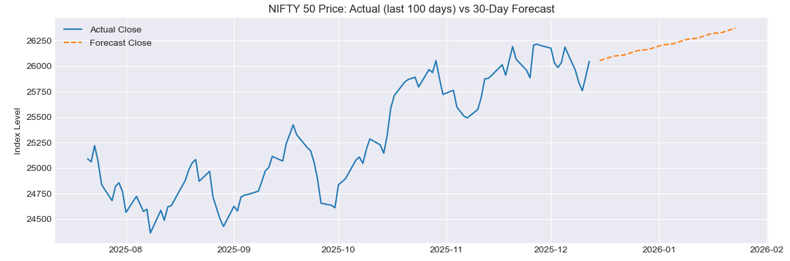
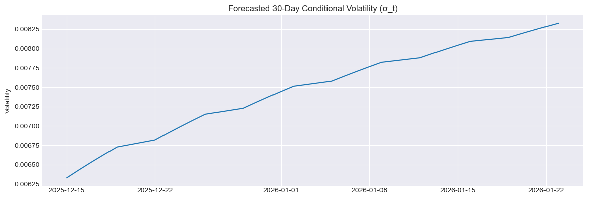

# NIFTY 50 Forecasting with ARIMA + GARCH

This project builds an end-to-end **time-series forecasting and volatility modelling pipeline** for the NIFTY 50 index using:

- **ARIMA** for the conditional mean of log returns
- **GARCH(1,1)** for time-varying volatility

It demonstrates core econometrics/time-series tools used in quantitative finance:
stationarity testing, ARIMA modelling, GARCH volatility, and short-horizon forecasting on real Indian market data.

---

## 1. Project Overview

**Objective:**  
Model NIFTY 50 daily log returns and volatility, then generate a **30-day forecast** of:

- Expected returns
- Conditional volatility
- Implied price path

**Key steps:**

1. Download NIFTY 50 (^NSEI) daily prices (2015–today) using `yfinance`.
2. Compute log returns and test stationarity with **ADF**.
3. Fit an **ARIMA(p,0,q)** model for the mean of returns (selected via AIC).
4. Fit a **GARCH(1,1)** model on ARIMA residuals for volatility clustering.
5. Generate 30-day ahead forecasts for returns, volatility, and prices.
6. Compare ARIMA forecasting error vs a naive benchmark using **RMSE**.

---

## 2. Methods & Models

### Stationarity & ADF

We test whether NIFTY log returns are stationary using the **Augmented Dickey–Fuller (ADF)** test:

- H0: Series has a unit root (non-stationary)  
- H1: Series is stationary

A low p-value (p < 0.05) supports treating log returns as stationary.

### ARIMA (Mean Dynamics)

We model the conditional mean of returns with ARIMA(p,0,q).  
A small grid of candidate models (e.g. (1,0,0), (0,0,1), (1,0,1)) is evaluated using **AIC**:
$$AIC = 2k - 2 \ln(\hat{L})$$

where \(k\) is the number of parameters and $\hat{L}$ is the maximized likelihood.  
The model with **minimum AIC** (here, **ARIMA(1,0,0)**) is selected.

### GARCH(1,1) (Volatility)

The ARIMA residuals show volatility clustering, so we model the conditional variance with **GARCH(1,1)**:

$$
\sigma_t^2 = \omega + \alpha \epsilon_{t-1}^2 + \beta \sigma_{t-1}^2
$$

Key interpretation:

- $\alpha$: impact of recent shocks  
- $\beta$: persistence of volatility  
- $\alpha + \beta \approx 1$: highly persistent volatility (typical for equity indices)

In this model, $\alpha + \beta \approx 0.98$, indicating strong persistence.

---

## 3. Results

### Forecast Plots

NIFTY price (last 100 days actual) vs 30-day forecast:

Forecasted 30-day conditional volatility (GARCH(1,1)):

### Forecast Accuracy 

On a recent 60-day test window, we compare:

- **ARIMA-based return forecast**
- **Naive benchmark** (constant last return / random walk)

We report **RMSE** for both; even modest improvements over the naive benchmark are valuable, and the volatility forecasts are particularly useful for **risk management**.

---

## Repository structure

- src/: main Jupyter notebook
- plots/: forecast and volatility plots
- README.md, requirements.txt
